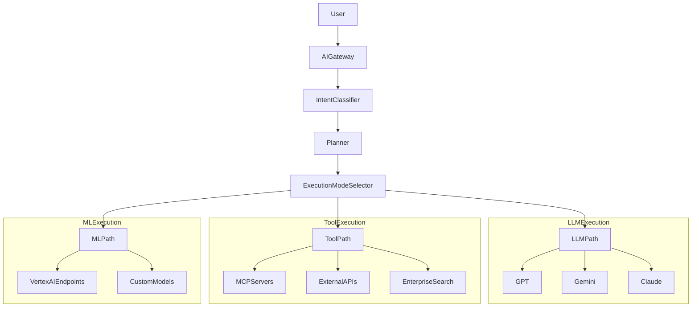

```mermaid
flowchart TD

User[User] --> Gateway[AIGateway]
Gateway --> Intent[IntentClassifier]
Intent --> Planner[Planner]
Planner --> Mode[ExecutionModeSelector]

Mode --> LLM[LLMPath]
Mode --> Tool[ToolPath]
Mode --> ML[MLPath]

subgraph LLMExecution
LLM --> GPT[GPT]
LLM --> Gemini[Gemini]
LLM --> Claude[Claude]
end

subgraph ToolExecution
Tool --> MCP[MCPServers]
Tool --> API[ExternalAPIs]
Tool --> Search[EnterpriseSearch]
end

subgraph MLExecution
ML --> Vertex[VertexAIEndpoints]
ML --> Custom[CustomModels]
end
```