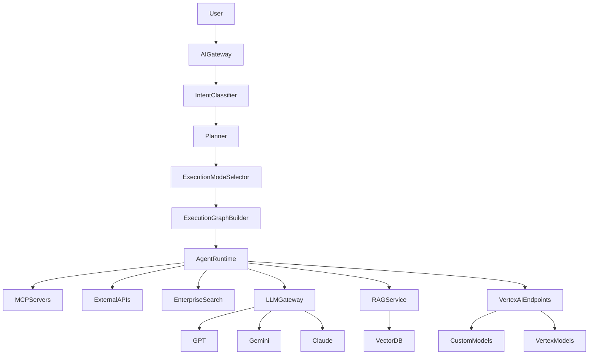

```mermaid
flowchart TD

%% =========================
%% CLIENTS
%% =========================
User[User]

%% =========================
%% CONTROL PLANE
%% =========================
Gateway[AIGateway]
Intent[IntentClassifier]
Planner[Planner]
Mode[ExecutionModeSelector]
Graph[ExecutionGraphBuilder]

%% =========================
%% RUNTIME PLANE
%% =========================
Agent[AgentRuntime]

%% =========================
%% TOOLS
%% =========================
ToolMCP[MCPServers]
ToolAPI[ExternalAPIs]
ToolSearch[EnterpriseSearch]
ToolRAG[RAGService]
ToolVertex[VertexAIEndpoints]
ToolLLM[LLMGateway]

VectorDB[VectorDB]

%% =========================
%% FLOW CONTROL
%% =========================

User --> Gateway
Gateway --> Intent
Intent --> Planner
Planner --> Mode
Mode --> Graph
Graph --> Agent

%% =========================
%% EXECUTION GRAPH STEPS
%% =========================

Agent --> ToolLLM
Agent --> ToolMCP
Agent --> ToolAPI
Agent --> ToolSearch
Agent --> ToolRAG
Agent --> ToolVertex

%% =========================
%% RAG FLOW
%% =========================

ToolRAG --> VectorDB

%% =========================
%% MODEL ROUTING
%% =========================

ToolLLM --> GPT[GPT]
ToolLLM --> Gemini[Gemini]
ToolLLM --> Claude[Claude]

ToolVertex --> CustomModels[CustomModels]
ToolVertex --> VertexModels[VertexModels]
```