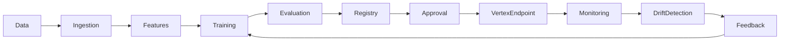

```mermaid
flowchart LR

Data[Data]
Ingest[Ingestion]
Features[Features]
Train[Training]
Eval[Evaluation]
Registry[Registry]
Approve[Approval]
Deploy[VertexEndpoint]
Monitor[Monitoring]
Drift[DriftDetection]
Feedback[Feedback]

Data-->Ingest
Ingest-->Features
Features-->Train
Train-->Eval
Eval-->Registry
Registry-->Approve
Approve-->Deploy
Deploy-->Monitor
Monitor-->Drift
Drift-->Feedback
Feedback-->Train
```